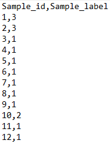

# Automatic-Music-Genre-Classification

Comparison of the performance of different machine learning techniques on an automatic music genre classification ensemble. Classification was decided to be the most prominent genre shown by the song out of 10 possible ones. The two performance metrics established in the evaluation phase were the log loss and accuracy.

# Project Description

The project revolves around the task of identifying the music genre of songs. This is useful as a way to group music into categories that can be later used for recommendation or discovery. The problem of music genre classification is difficult: while some genres distinctions are fairly straightforward (e.g. heavy metal vs classical), others are fuzzier (e.g. rock vs blues). The task was to construct a predictor h(x) for each genre Y, which takes the features x and maps it to a probability h(x) that the genre is "rock" (e.g.) or not. The classification would then be carried out as the most prominent genre - the largest probability found.

This work explores the use of logistic regression, support vector machines and gradient boosting as classifiers paired with some optimization methods such as feature scaling and grid search.

## The Data

The dataset along with the songs correct classification was fetched from AllMusic.com. It contained preprocessed audio information - in particular, the raw audio signals had been transformed previously to carefully chosen features. 

The labels from the dataset were taken from the following list:

1. 'Pop_Rock'
2. 'Electronic'
3. 'Rap'
4. 'Jazz'
5. 'Latin'
6. 'RnB'
7. 'International'
8. 'Country'
9. 'Reggae'
10. 'Blues'

## Evaluation

Evaluation was performed on the Kaggle online platform in accordance to a participation in a competition between all the students of the course. The two metrics evaluated on Kaggle were accuracy and log loss.

The accuracy competition can be found [here](https://www.kaggle.com/c/mlbp-2017-da-challenge-accuracy)
The log loss competition can be found [here](https://www.kaggle.com/c/mlbp-2017-da-challenge-logloss)

Besides this, validation was also taken upon with the generation of confusion matrices for all techniques to analyse the performance of all methodologies.

## Output

The output file for the accuracy competition had the form of Sample id followed by Sample Genre. An example can be seen below:

The output file for the log loss metric showcased the Sample id paired with a probability value for all Sample genres. Again, an example can be seen below.

|[Log Loss](Resources/output_log_loss.png)

## Built With

* [Python 3.6.3](https://www.python.org/downloads/release/python-363/) - Python version used
* [Scikit learn](http://scikit-learn.org/) - Machine library used to employ the methods
* [Jupyter Notebook](http://jupyter.org/) - Jupyter notebooks were used in development

## Authors

* **Filipa Ramos** - *Initial work* - [FilipaRamos](https://github.com/FilipaRamos)
* **Pedro Pontes** - *Initial work* - [pmpontes](https://github.com/pmpontes)
